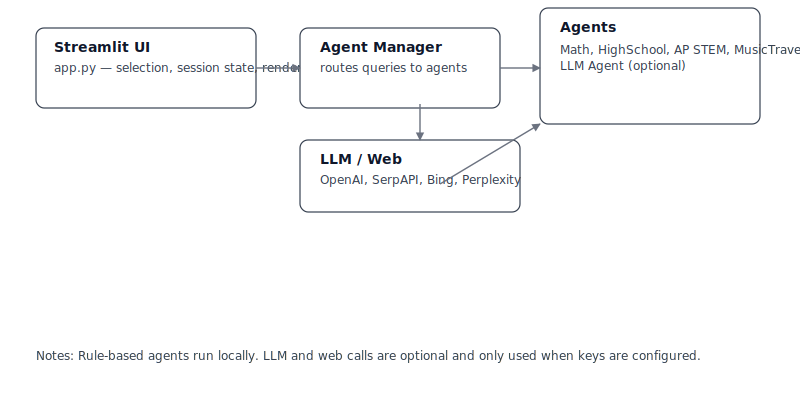

# Agent Chatbot — Learning Repo

This repository is a small, hands-on example for students who want to learn how to build simple agentic systems and to experiment with LLMs safely.

Who this is for
- Entry-level college students learning software design, testing, and responsible use of LLMs.

## Architecture Overview




What you'll find
- A Streamlit UI in `app.py` where you can pick agents, send questions, and see responses.
- Focused agents in `agents/` (math, high-school topics, music & travel, AP-STEM).
- An optional `LLM Agent` that calls an external provider only when you provide an API key.

Quick start

1. Install dependencies:

```powershell
python -m pip install -r requirements.txt
```

2. Run the app:

```powershell
streamlit run app.py
```

3. Useful UI tips:
- Use the sidebar to pick an agent or enable `Auto-detect` (keyword routing).
- Enter an API key in the sidebar only if you want the LLM fallback to run.
- Toggle `Compact mode` to reduce spacing for a tighter layout.

Why this setup
- Agents are small so you can read and test them quickly.
- The manager handles routing and only uses the LLM when you explicitly allow it.

Safety notes
- Never commit API keys. Enter keys in the UI for short experiments.
- Rule-based agents run locally and do not send user text out by default.

Exercises & Examples

- Exercise 1 — Compare agents: Pick a question such as "Explain how gravity works in one paragraph." Ask the same question to the Math agent, the High-School agent, and the LLM agent (if you have an API key). Note differences in style, depth, and whether the answer mentions sources.

- Exercise 2 — Add a tiny agent: Create a new file `agents/echo_agent.py` that returns the same text it receives. Add a test in `tests/test_echo_agent.py` that checks the behavior and run `pytest`.

- Exercise 3 — Tweak routing (optional): Open `agents/intent_router.py` and change or add a keyword rule to route certain queries to a new `career_agent`. Try several queries and observe how agent selection changes.

Quick sample — `echo_agent.py` (copy into `agents/echo_agent.py`):

```python
class EchoAgent:
    name = "Echo Agent"

    def handle(self, query: str):
        return {"text": query, "provider": "local", "urls": []}

# Minimal test for the echo agent (put in tests/test_echo_agent.py):
def test_echo_agent():
    agent = EchoAgent()
    out = agent.handle("Hello")
    assert out["text"] == "Hello"
```

Run the tests after adding the agent:

```powershell
python -m pip install -r requirements.txt
pytest -q
```

Where to look next
- `ARCHITECTURE.md` — a short developer-focused overview and a diagram.
- `tests/` — simple tests you can run and extend.

Have fun learning — this is a playground for learning developing with Agents, not production code.
